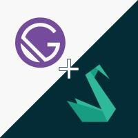
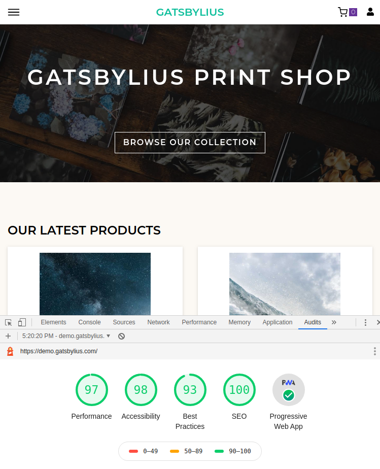

<div align="center">
  <h1>Gatsbylius</h1>



  <p>

**The fastest Open Source storefront for Sylius.**

Gatsbylius leverages Gatsby for building eCommerce PWA storefronts using React backed by a headless Sylius store.
Gatsby + Sylius = :rocket:,
[Try the demo.](https://demo.gatsbylius.com/)

  </p>

  <p>

[](https://github.com/prettier/prettier)


[](https://github.com/Gatsbylius/Gatsbylius/issues)

[](https://twitter.com/gatsbylius)

  </p>

Started with :heart: :beers: :fire: in [Béthune #opengento](https://twitter.com/opengento/status/1196360198769778688)

</div>

## Overview

**⚠️ Alpha software:** Gatsbylius is in active development, things will change but contributions are welcome.

Gatsbylius contains everything you need to get started in minutes on an existing Sylius project with the Shop API enabled.
Consider it as a boilerplate for creating your next eCommerce application.

Here is what Gatsbylius can help you with:

- start using new technologies (React, GraphQL) and concepts (JAMStack),
- experiment an idea with your team,
- build your new store theme with performance and user experience on mobile devices in mind,
- convince your boss,
- or win projects by building a <abbr title="Proof of Concept">PoC</abbr>.



## Features

- **zero configuration:** start developing right away, all the tooling is already configured for you
- **great developer experience:** get in the flow with immediate feedback and interactive tools (<abbr title="Hot Module Reloading">HMR</abbr>, GraphQL…)
- **modern web technologies without the worries:** use up-to-date libraries with their latest features. We already took care of ensuring it all work!
- **scale infinitely:** Gatsbylius generates most pages of your shop as "static" files. It means easy deployments and cheaper hosting, with unlimited scaling to handle heavy traffic
- **<abbr title="Progressive Web Apps">PWA</abbr>:** leverage the latest best web practices to have the fastest possible storefront in mobile contexts

## Get started

Start building something now!

The following steps are all you need if you already are familiar with the JavaScript ecosystem.

> More detailed steps will be documented later!

### Installation

```
npm install gatsby-theme-sylius
```

### Configuration

```javascript
// In your gatsby-config.js

plugins: [
    ...
    {
      resolve: `gatsby-theme-sylius`,
      options: {
        syliusUrl: `https://{{your-sylius-url}}`,
      },
    },
    ...
  ],
```

You need at least the `syliusUrl` options. If you want to try it out quickly, you can use our demo instance `https://api.gatsbylius.com`.

### Start it!

```
npm start
```

If you use the `gatsby-starter-default`, you will need to remove the src folder content because we already define the `Layout` in the theme.
To override it, you can use [Gatsby shadowing](https://www.gatsbyjs.org/docs/themes/shadowing/), more documentation will be done on this subject soon!

## Get help

If you need help we encourage you to search on the web first. It will help you discover the community around both project (Gatsby & Sylius). You might find additional resources for learning each library in-depth when you will be ready.

Useful resources:

- https://docs.sylius.com/en/latest/index.html
- https://app.swaggerhub.com/apis/Sylius/sylius-shop-api/1.0.0#/Product
- https://www.gatsbyjs.org/docs/

You can also open
[issues](https://github.com/Gatsbylius/Gatsbylius/issues) with the
tag `"question"` and we will do our best to answer it. Of course, you can
[browse answered questions](https://github.com/Gatsbylius/Gatsbylius/issues?q=is%3Aissue+label%3Aquestion+is%3Aopen)
and try to help others by answering their opened questions.

If you need anything else, [send an email to the team behind it!](mailto:contact@gatsbylius.com) We can also take care of your project!

## Setting up a local dev environment

If you wish to contribute to the project, this part will describe how to get a local dev environment up and running.

> We use [Lerna](https://github.com/lerna/lerna) and [Yarn](https://yarnpkg.com/) to manage a monorepo. It allows us to easily manage and publish our packages.

### Installation

#### Node and yarn

- Install node at least with the version (>= 10.16.0) `node --version`
- Install Yarn at least with the version (>= 1.0.2) `yarn --version`

#### Fork and clone

1. Fork the [gatsbylius/gatsbylius](https://github.com/gatsbylius/gatsbylius) repository
2. `git clone git@github.com:<your-username>/Gatsbylius.git`
3. `cd Gatsbylius && yarn run bootstrap`
4. `cd demo`
5. create an `.env.development` file based on the `.env.development.dist` files in the repository root
6. `yarn start`
7. open your favorite editor and start coding!

## License

MIT
